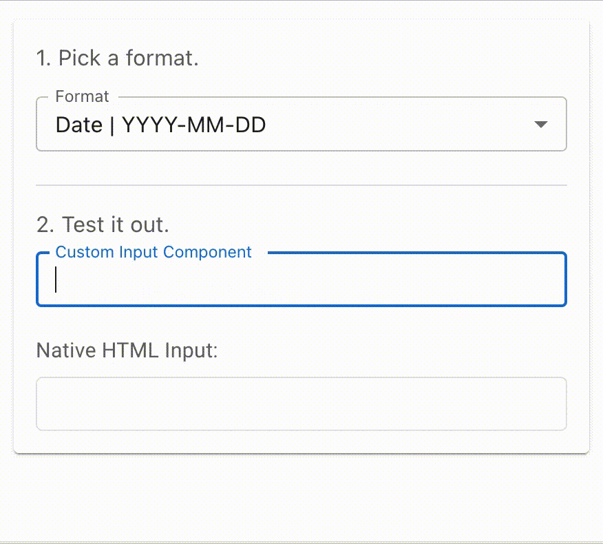

# Format As You Type

#### The simplest field formatting and masking tool for React.

Format fields the way you want using the input components you already use. Real-time. No hassle.

## Overview

* Install by running `npm i format-as-you-type` or `yarn add format-as-you-type`.
* Import to a React component using `import useFieldFormatter from 'format-as-you-type'`.
* Define a hook instance by passing in:
  1. A formatter (see below),
  2. A callback function that executes `onChange` (E.g., `const birthdayFormatter = useFieldFormatter(formatDate, setBirthday);`), and
  3. (Optionally) a custom ref prop to use on your field instead of the default `ref={}`.†
* The hook instance contains props to pass to your input component. Implement them by simply adding `{ ...yourConstantName }` at the end of the component's props.
<!-- * [See for yourself!]() -->

<p align="center">
  
</p>
 
Want to see more examples? Keep reading!

† As you will see further below, there are some custom input components that won't behave as expected when using `ref={}`.

## Generic Formatters

While you can make your own formatters, there are a few that are ready to use:

* formatDate
* formatPhone
* formatCreditCard
* formatBigNumber
* formatPostalCodeCanada

More generic formatters will be added with upcoming versions. However, if you have an idea for a new one, feel free to suggest it by creating an issue.

See the __API__ header further below to learn more about each function's options and parameters.

## Make Your Own Formatter

Generic formatters not getting the job done? Make your own! Just import `formatString`. Here's an example:

```
import { formatString } from 'format-as-you-type';

const formatCustom = (newInput, options, /* any additional parameters */) => {
  // Any extra logic goes here...

  return formatString(newInput, '0000 \ 0000', options);
};
```

That same example can be implemented into the `useFieldFormatter` hook in a component like so:

```
const customFieldFormatter = useFieldFormatter(
  (newValue, options) => formatString(newInput, '0000 \ 0000', { ...options }),
  setCustomField,
);
```

Custom formats can either contain placeholder characters such as `A` for letters and `0` for numbers (e.g. `(000) 000-0000`), or actual letters and numbers (e.g. `(604) 123-4567`). All that matters is where separators (non-numbers and non-letters) are placed.

\***** The only rule is that __the first parameter must be the string being formatted__ and __the second parameter must accept an options argument__. \*****

## Implementing a Formatter in a Plain HTML Field

Implementing `useFieldFormatter` in a plan HTML field is easy:

```
import React from 'react';
import useFieldFormatter, { formatDate } from 'format-as-you-type';

const YourFormComponent = (props) => {
  const [birthday, setBirthday] = React.useState('');

  const birthdayFormatter = useFieldFormatter(formatDate, setBirthday);

  return (
    <form>
      /* ... */

      <label htmlFor="birthday">Birthday</label>
      <input
        id="birthday"
        value={birthday}
        { ...birthdayFormatter }
      />

      /* ... */
    </form>
  );
};
```

## Implementing a Formatter in a Custom Component

When using `useFieldFormatter` on a custom text field component, you may encounter warnings, errors, or other unpredictable behaviour. That's because, in the context of our example, spreading `birthdayFormatter` in a component yields the following by default:

```
<InputComponent
  /* other props */
  onChange={(event) => ourChangeHandler(event)}
  ref={ourInternalInputRef}
/>
```

Some custom input components don't work without using a different prop instead, such as `innerRef`, `inputRef`, etc., or wrapping the component in a `React.forwardRef`.

Since we can't (yet) predict what type of component the hook will be spread into, the simplest solution, at the moment, is to provide the ref prop as the third argument when initializing `useFieldFormatter`.

In Material-UI's case, this is `inputRef`. If you use another library and run into problems, give their documentation a read. For our example, though, we'll stick to Material-UI:

```
import React from 'react';
import useFieldFormatter, { formatDate } from 'format-as-you-type';
import TextField from '@mui/material/TextField';

const YourFormComponent = (props) => {
  const [birthday, setBirthday] = React.useState('');

  const birthdayFormatter = useFieldFormatter(formatDate, setBirthday, 'inputRef');

  return (
    <form>
      /* ... */

      <TextField
        label="Birthday"
        value={birthday}
        { ...birthdayFormatter }
      />

      /* ... */
    </form>
  );
};
```

## API

### useFieldFormatter

`useFieldFormatter(formatter, onChange, refProp = 'ref')`

##### Parameters

| Parameter | Description |
| --------- | ----------- |
| formatter | A generic or custom formatter function (see below) that takes in (1) a string and (2) an options object, in that order. |
| onChange | A callback function to update your field's value after if has been formatted. (This should have the structure `(newValue) => setValueSomewhere(newValue)`) |
| refProp | The prop to use to pass our internal prop to your input component. Is `'ref'` by default for plain HTML fields, but can be replaced with `inputRef`, `innerRef`, or whichever prop is instructed by your specific component/library. |

### formatDate

`formatDate(newInput, options, format = 'YYYY-MM-DD')`

### formatPhone

`formatPhone(newInput, options, format = '(000) 000-0000')`

### formatCreditCard

`formatCreditCard(newInput, options, infoType = 'NUMBER')`

##### Special parameters

| Parameter | Description | Options |
| --------- | ----------- | ------- |
| infoType | Whether to parse a credit card's number or its expiry date | NUMBER, EXPIRY_2 (`MM / YY`), EXPIRY_4 (`MM / YYYY`)|

##### Info

* This formatter is intended for credit cards with 16-digit numbers.
* If the first digit of a credit card's number is `3`, it will be formatted like an AMEX card. Otherwise, it'll be formatted in groups of four digits.
* If your form might take credit cards with more than 16 numbers, feel free to make a custom formatter using `formatString` (see further below).

### formatBigNumber

`formatBigNumber(newInput, options, locale)`

##### Special parameters

| Parameter | Description | Options |
| --------- | ----------- | ------- |
| locale | The region that determines how a number is formatted (e.g. 0,000,000 in English vs. 0.000.000 in French) | [en-US, fr-CA, etc...](https://stackoverflow.com/questions/3191664/list-of-all-locales-and-their-short-codes)† |

† This list will be converted to `type LocaleTypes = ...` once this package is converted to TypeScript very soon.

### formatPostalCodeCanada

`formatBigNumber(newInput, options)`

##### Info

This function simply formats strings to match the `A0A 0A0` format.

### formatString

`formatString(newInput, format, options)`

##### Special parameters

| Parameter | Description | Default Value |
| --------- | ----------- | ------- |
| options | Customization for the formatter. See documentation below. | `{}` |

##### Options

| Option | Description | Type (Default Value) |
| ------- | ----------- | ------------ |
| lettersAsSeparators | Treat letters as a separator. I.e. don't format them. | boolean (`false`) |
| numbersOnly | Doesn't allow letters in input. | boolean (`false`) |
| lettersOnly | Doesn't allow numbers in input. | boolean (`false`) |
| allCaps | Forces letters to be capitalized. | boolean (`false`) |
| customFormatter | Skip `formatString()` and use a custom formatter, such as JavaScript's built-in `number.toLocaleString()`, which is used in `formatBigNumber()`. | function that returns a string |
